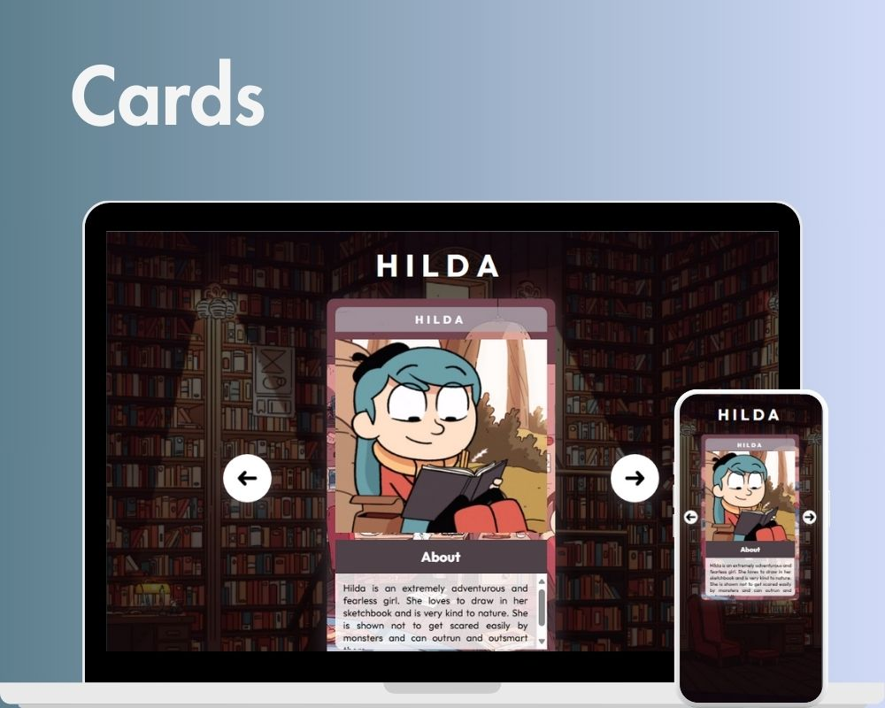

<h1 align="center"> Cards </h1>

  <a href="#-tecnologias">Tecnologias</a>&nbsp;&nbsp;&nbsp;|&nbsp;&nbsp;&nbsp;
  <a href="#-projeto">Projeto</a>&nbsp;&nbsp;&nbsp;|&nbsp;&nbsp;&nbsp;
  <a href="#-licença">Licença</a>

  

 

  

## 🚀 Tecnologias

Esse projeto foi desenvolvido com as seguintes tecnologias:

- HTML e CSS
- JavaScript
- Git e Github

## 💻 Projeto

A página é uma apresentação breve de alguns personagens da série Hilda, utilizando uma formato de carta, 
cada uma possui o nome do respectivo personagem e um texto curto sobre o mesmo. Clicando nas setas ao lado 
da carta o usuário pode avançar ou voltar o personagem selecionado, são 7 personagens no total.

## 📝 Licença

Esse projeto está sob a licença MIT.

---

Feito por Sullara Tavares
